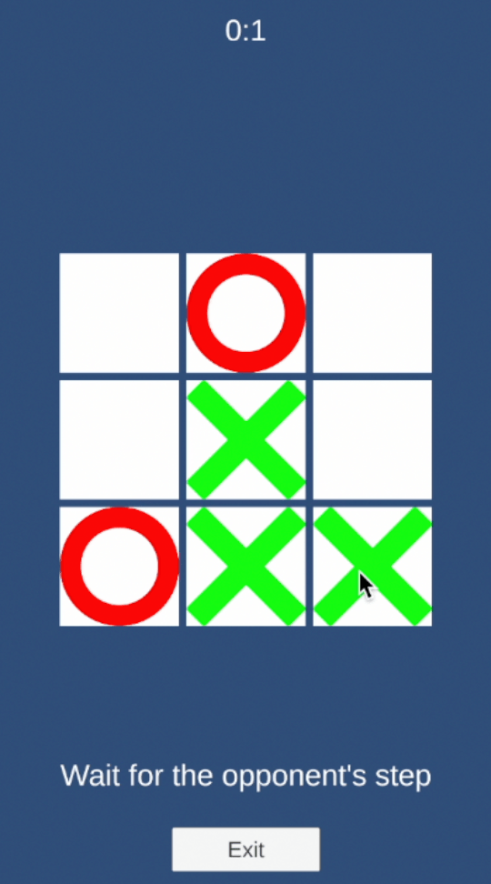

<a href="./README.md"></a>
<a href="./README.ru.md"></a>
<p align="center">
    <picture>
        <source media="(prefers-color-scheme: dark)" srcset="Media/logo-unity-dark.png">
        <source media="(prefers-color-scheme: light)" srcset="Media/logo-unity.png">
        
    </picture>
</p>
<h3 align="center">Unity client for Shardy</h3>
<h4 align="center">Framework for online games and apps</h4>
<p align="center">
    <a href="#quick-start">Quick start</a> · <a href="./Documentation~/index.md">Docs</a> · <a href="https://github.com/mopsicus/shardy">Shardy</a> · <a href="https://github.com/mopsicus/shardy-template">Service template</a> · <a href="https://github.com/mopsicus/shardy-unity/issues">Report Bug</a>
</p>

# 💬 Overview

This package is a Unity client for Shardy. It provides RPC framework with simple user-friendly API: requests, commands and subscribe for communication with Shardy microservices. 

Shardy is a framework for online games and applications for Node.js. It provides the basic functionality for building microservices solutions: mobile, social, web, multiplayer games, realtime applications, chats, middleware services, etc.
 
[Read about Shardy](https://github.com/mopsicus/shardy) 💪

# ✨ Features

- Simple API: request, response, subscribe, etc
- Socket and Websocket communication
- iOS, Android and WebGL support
- Lightweight and fast
- Support custom serialization
- Support custom handshake validation
- Connection heartbeat support
- Good reference materials: docs, snippets, samples
- No 3rd party libs

# 🚀 Usage

### Installation

Get it from [releases page](https://github.com/mopsicus/shardy-unity/releases) or add the line to `Packages/manifest.json` and module will be installed directly from Git url:

```
"com.mopsicus.shardy": "https://github.com/mopsicus/shardy-unity.git",
```

### Environment setup

For a better experience, you can set up an environment for local development. Since Shardy is developed with VS Code, all settings are provided for it.

1. Use `Monokai Pro` or `eppz!` themes
2. Use `FiraCode` font
3. Install extensions:
    - C#
    - C# Dev Kit
    - Unity
4. Enable `Inlay Hints` in C# extension
5. Install `Visual Studio Editor` package in Unity
6. Put `.editorconfig` in root project directory
7. Be cool

### Quick start

See the sample section to get a [demo app](./Samples~/Demo). This demo shows you how to use client's methods and options. If you want to test your own demo backend, see how to install and launch [service template](https://github.com/mopsicus/shardy-template).

_Tested in Unity 2022.3.x, Android, iOS and WebGL._

<p align="center">
    <picture>
        
    </picture>
</p>

### Tic-Tac-Toe

Also, in sample section you can get [Tic-Tac-Toe](./Samples~/TicTacToe) multiplayer online game example. Explore the example to get in mind how you can organize your client-server communation and how to start developing your new multiplayer game or add a multiplayer feature to an existing game.

<p align="center">
    <picture>
        
    </picture>
</p>

See the [game server](https://github.com/mopsicus/shardy-tictactoe) for Tic-Tac-Toe. Get a simplest server example made on Shardy for testing and development.

### Requests and commands

The general difference between requests and commands that is other side must respond to requests and doesn't respond to commands. So this means that when you make a request, you have a callback with response data. And when you send a command, you are simply notifying the other side about something.

Request:

```csharp
_client.Request("test", (data) => {
    Console.WriteLine($"received test data: ${data.ToString()}");
});
```

Command:

```csharp
_client.Command("start");
```

Subscribe:

```csharp
_client.On("lookup", (data) => {
    Console.WriteLine($"received lookup data: ${data.ToString()}");
});
```

Subscribe on request:

```csharp
_client.OnRequest(request, (payload) => {
    Console.WriteLine($"received request data: ${payload.ToString()}");    
    // if comment line below, you will give timeout on your backend
    _client.Response(payload, Encoding.UTF8.GetBytes("some_data_from_client"));
});
```

### Validation

When a client connects to the server, it must successfully complete the handshake before it can begin. Shardy uses a two-step handshake for connections.

Stages of handshake:

1. The client sends a handshake to the server
2. Server receives and verifies it:
    - Sends an acknowledgement to the client
    - Disconnects the client, if the verification fails
3.  The client receives the acknowledgement and verifies it:
    - Sends a reply acknowledgement to the server
    - Disconnects, if the verification fails
4. After verifying the handshake and acknowledgement, the client and server can communicate with each other

If your implementation doesn't need to do a two-step handshake, you can set "stubs" on these methods.

Shardy provides an interface for handshake validation. You can implement your own handshake data structure and validation for all these stages. Create your validator class, implement `IValidator` interface methods and pass it to your service and client.

```csharp
using Shardy;

class MyHandshake : IValidator {

    public ValidatorState VerifyAcknowledgement(byte[] body) {
        // vefify acknowledgement data
    }

    public byte[] Handshake(byte[] body = null) {
        // data for initial handshake
    }

    public byte[] Acknowledgement(byte[] body) {
        // data for acknowledgement after handshake validation passed
    }
}
```

### Serialization

Shardy supports custom serialization of transmitted data. You can use JSON, MessagePack, Protobuf, FlatBuffers, etc. or your own serializer.

Create your serializer class, implement `ISerializer` methods and pass it to your service and client.

```csharp
using Shardy;

class MyJsonSerializer : ISerializer {

    public byte[] Encode(PayloadData body) {
        // encode PayloadData to byte array for transporting
    }

    public PayloadData Decode(byte[] body) {
        // decode recevied data and serialize to PayloadData
    }
}
```

See [documentation](./Documentation~/index.md) for information on all classes and methods.

# 🧩 Modules

[FSM](https://github.com/mopsicus/shardy-fsm) – implementation of a finite state machine with flexible API: states, triggers, conditions.

# 🗓️ Plans

The plans are truly grand! It is to create an ecosystem for developers who will be able to build their game backend out of existing Shardy services like bricks, and compose mobile clients from Shardy modules.

Listed below are some of the modules I plan to make:
- base helpers
- binding UI
- event bus
- scene/screen manager
- localization
- sound manager
- ads manager

The list is endless. Be in touch.

# 🏗️ Contributing

We invite you to contribute and help improve Unity client for Shardy. Please see [contributing document](./CONTRIBUTING.md). 🤗

You also can contribute to the Shardy project by:

- Helping other users 
- Monitoring the issue queue
- Sharing it to your socials
- Referring it in your projects

# 🤝 Support

You can support Shardy by using any of the ways below:

* Bitcoin (BTC): 1VccPXdHeiUofzEj4hPfvVbdnzoKkX8TJ
* USDT (TRC20): TMHacMp461jHH2SHJQn8VkzCPNEMrFno7m
* TON: UQDVp346KxR6XxFeYc3ksZ_jOuYjztg7b4lEs6ulEWYmJb0f
* Visa, Mastercard via [Boosty](https://boosty.to/mopsicus/donate)
* MIR via [CloudTips](https://pay.cloudtips.ru/p/9f507669)

# ✉️ Contact

Before you ask a question, it is best to search for existing [issues](https://github.com/mopsicus/shardy-unity/issues) that might help you. Anyway, you can ask any questions and send suggestions by [email](mailto:mail@mopsicus.ru) or [Telegram](https://t.me/mopsicus).

# 🔑 License

Unity client for Shardy is licensed under the [MIT License](./LICENSE.md). Use it for free and be happy. 🎉