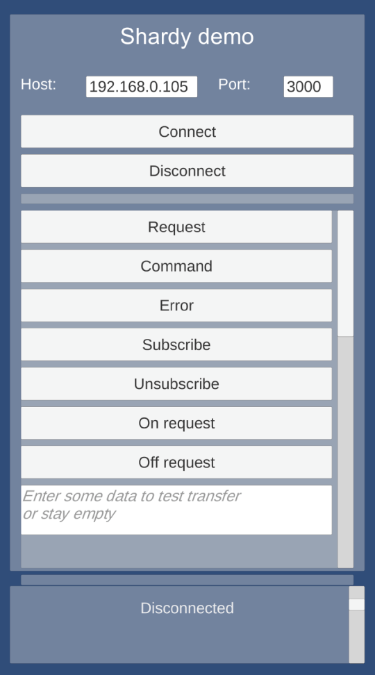
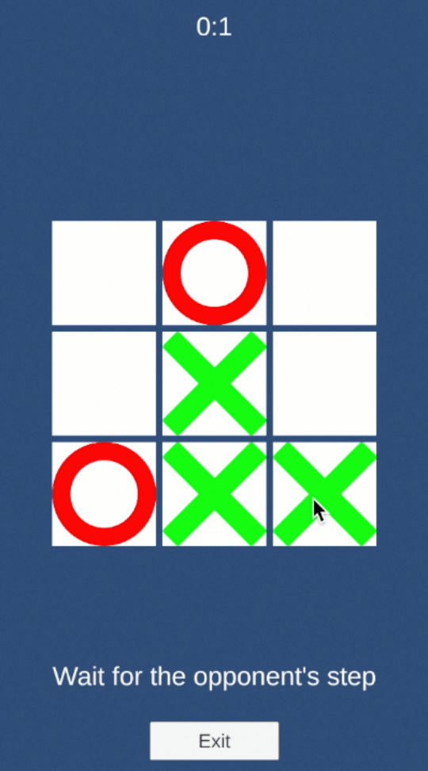

<a href="./README.md"></a>
<a href="./README.ru.md"></a>
<p align="center">
    <picture>
        <source media="(prefers-color-scheme: dark)" srcset="Media/logo-unity-dark.png">
        <source media="(prefers-color-scheme: light)" srcset="Media/logo-unity.png">
        
    </picture>
</p>
<h3 align="center">Unity клиент для Shardy</h3>
<h4 align="center">Фреймворк для онлайн игр и приложений</h4>
<p align="center">
    <a href="#быстрый-старт">Быстрый старт</a> · <a href="./Documentation~/index.md">Документация</a> · <a href="https://github.com/mopsicus/shardy">Shardy</a> · <a href="https://github.com/mopsicus/shardy-template">Пример сервиса</a> · <a href="https://github.com/mopsicus/shardy-unity/issues">Отчёт об ошибке</a>
</p>

# 💬 Описание

Это Unity клиент для Shardy. Он предоставляет RPC-фреймворк с простым и удобным API: запросы, команды и подписки для взаимодействия с Shardy-сервисами.

Shardy – это фреймворк для онлайн игр и приложений на Node.js. Он предоставляет базовую функциональность для построения микросервисных решений: мобильных, социальных, веб, многопользовательских игр, приложений реального времени, чатов, middleware сервисов и т.п.

[Узнать про Shardy](https://github.com/mopsicus/shardy) 💪

# ✨ Возможности

- Простой API: запросы, команды, подписки и т.п.
- Транспорт данных через сокеты и вебсокеты
- iOS, Android и WebGL поддержка
- Легкий и быстрый
- Поддержка пользовательской сериализации
- Поддержка пользовательской валидации рукопожатий (handshake)
- Настраиваемый heartbeat для соединения
- Справочные материалы: документация, сниппеты, примеры
- Не используются сторонние библиотеки

# 🚀 Использование

### Установка

Скачайте пакет со страницы [релизов](https://github.com/mopsicus/shardy-unity/releases) или добавьте строчку ниже в ваш файл `Packages/manifest.json` и пакет будет установлен по адресу Git репозитория:

```
"com.mopsicus.shardy": "https://github.com/mopsicus/shardy-unity.git",
```

### Настройка окружения

Настройте своё окружение для локальной разработки для удобства и "синхронизации" с текущим проектом. Так как Unity клиент для Shardy разрабатывается с использованием редактора VS Code, то все настройки и рекомендации предложены для него.

1. Используйте `Monokai Pro` или `eppz!` тему
2. Используйте `FiraCode` шрифт
3. Установите расширения:
   - C#
   - C# Dev Kit
   - Unity
4. Включите `Inlay Hints` в настройках C# расширения
5. Установить пакет `Visual Studio Editor` в редакторе Unity
6. Поместите файл `.editorconfig` в корневую папку проекта
7. Ура!

### Быстрый старт

Посмотрите раздел с примерами и скачайте [демо приложение](./Samples~/Demo). Это демо покажет вам как использовать методы клиента и какие есть опции. Если вы хотите использовать для тестов собственный backend, посмотрите как установить и запустить [пример сервиса](https://github.com/mopsicus/shardy-template).

_Протестировано в Unity 2022.3.x, Android, iOS и WebGL._

<p align="center">
    <picture>
        
    </picture>
</p>

### Крестики-Нолики

Также, из раздела с примерами вы можете взять демо клиента для многопользовательской онлайн игры [Крестики-Нолики](./Samples~/TicTacToe). Изучите пример чтобы понять, как работает клиент-серверное взаимодействие и как начать разрабатывать свою собственную онлайн игру, или как добавить мультиплеер в уже существующую.

<p align="center">
    <picture>
        
    </picture>
</p>

Посмотрите [пример сервера](https://github.com/mopsicus/shardy-tictactoe) для игры Крестики-Нолики. Скачайте, изучите и протестируйте простой игровой сервер сделанный на Shardy.

### Запросы и команды

Главное отличие между запросами и командами – серверная сторона должна ответить на запрос и не должна на команду. Это означает, что когда вы делаете запрос, у вас есть функция обратного вызова (callback) и когда сервер ответит, в неё придёт результат. Когда вы отправляете команду, то вы просто "информируете" сервер о чём-то.

Запрос:

```csharp
_client.Request("test", (data) => {
    Console.WriteLine($"received test data: ${data.ToString()}");
});
```

Команда:

```csharp
_client.Command("start");
```

Подписка:

```csharp
_client.On("lookup", (data) => {
    Console.WriteLine($"received lookup data: ${data.ToString()}");
});
```

Подписка на запрос с сервера:

```csharp
_client.OnRequest(request, (payload) => {
    Console.WriteLine($"received request data: ${payload.ToString()}");    
    // если закомментировать строку ниже, вы получите таймаут на сервере
    _client.Response(payload, Encoding.UTF8.GetBytes("some_data_from_client"));
});
```

### Валидация

Когда клиент подключается к серверу, он должен успешно завершить рукопожатие (handshake) перед началом работы. В Shardy используется двухэтапное рукопожатие для соединений.

Этапы рукопожатия:

1. Клиент отправляет данные рукопожатия на сервер
2. Сервер получает и проверяет их:
    - Отравляет подтверждение клиенту
    - Отключает клиента, если проверка не прошла
3.  Клиент получает данные подтверждения и тоже проверяет их:
    - Отправляет ответ на подтверждение серверу
    - Отключается, если проверка не прошла
4. После успешного рукопожатия и подтверждения, клиент и сервер могут отправлять друг другу запросы и команды.

Если в вашей реализации нет необходимости делать двухэтапное рукопожатие, вы можете установить "заглушки" на этих методах.

Shardy предоставляет интерфейс для валидации рукопожатия. Вы можете реализовать собственную структуру данных рукопожатия и валидацию для всех этих этапов. Создайте свой класс с валидатором, релизуйте интерфейс `IValidator` и передайте его в конструктор клиента.

```csharp
using Shardy;

class MyHandshake : IValidator {

    public ValidatorState VerifyAcknowledgement(byte[] body) {
        // vefify acknowledgement data
    }

    public byte[] Handshake(byte[] body = null) {
        // data for initial handshake
    }

    public byte[] Acknowledgement(byte[] body) {
        // data for acknowledgement after handshake validation passed
    }
}
```

### Сериализация

Shardy поддерживает пользовательскую сериализацию передаваемых данных. Вы можете использовать JSON, MessagePack, Protobuf, FlatBuffers и т.д. или свой собственный сериализатор.

Создайте свой класс с сериализатором, релизуйте интерфейс `ISerializer` и передайте его в конструктор клиента.

```csharp
using Shardy;

class MyJsonSerializer : ISerializer {

    public byte[] Encode(PayloadData body) {
        // encode PayloadData to byte array for transporting
    }

    public PayloadData Decode(byte[] body) {
        // decode recevied data and serialize to PayloadData
    }
}
```

Смотрите [документацию](./Documentation~/index.md) с информацией о всех классах и методах.

# 🧩 Модули

[FSM](https://github.com/mopsicus/shardy-fsm) – конечный автомат (finite state machive) с гибким API: состояния, триггеры, условия

# 🗓️ Планы

Планы реально грандиозные! Развитие экосистемы для разработчиков, которые смогут создавать свои игры на основе существующих или собственных Shardy-сервисов, почти как из готовых блоков, а также добавлять модули в свои мобильные клиенты.

Ниже список сервисов которые планирую сделать:
- базовые хелперы
- биндинг UI
- шина данных
- менеджер сцен/экранов/попапов
- локализация
- менеджер звуков
- менеджер рекламы

На самом деле список бесконечный... Следите за новостями.

# 🏗️ Развитие

Мы приглашаем вас внести свой вклад и помочь улучшить Unity клиент для Shardy. Пожалуйста, ознакомьтесь с [документом](./CONTRIBUTING.md). 🤗

Вы также можете внести свой вклад в проект Shardy:

- Помогая другим пользователям
- Мониторя список существующих проблем
- Рассказав о проекте в своих соцсетях
- Используя его в своих проектах

# 🤝 Поддержка

Вы можете поддержать проект любым из способов ниже:

* Bitcoin (BTC): 1VccPXdHeiUofzEj4hPfvVbdnzoKkX8TJ
* USDT (TRC20): TMHacMp461jHH2SHJQn8VkzCPNEMrFno7m
* TON: UQDVp346KxR6XxFeYc3ksZ_jOuYjztg7b4lEs6ulEWYmJb0f
* Карты Visa, Mastercard через [Boosty](https://boosty.to/mopsicus/donate)
* Карты МИР через [CloudTips](https://pay.cloudtips.ru/p/9f507669)

# ✉️ Контактная информация

Перед тем как задать вопрос, лучшим решением будет посмотреть уже существующие [проблемы](https://github.com/mopsicus/shardy-unity/issues), это может помочь. В любом случае, вы можете задать любой вопрос или отправить предложение по [email](mailto:mail@mopsicus.ru) или [Telegram](https://t.me/mopsicus).

# 🔑 Лицензия

Unity клиент для Shardy выпущен под лицензией [MIT](./LICENSE.md). Используйте бесплатно и радуйтесь. 🎉